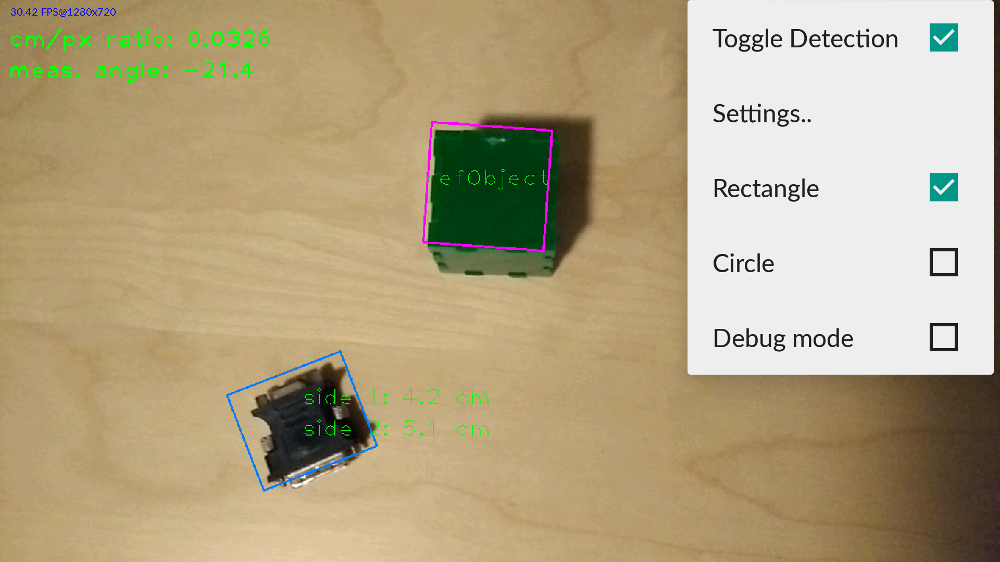
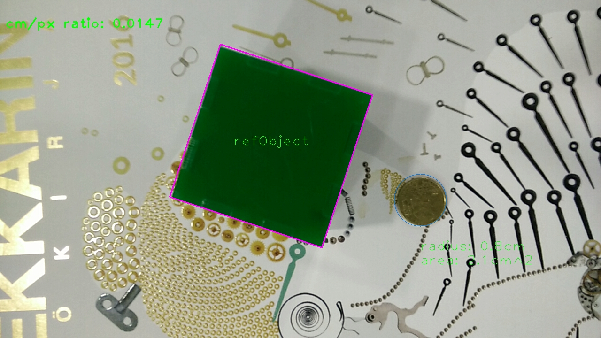
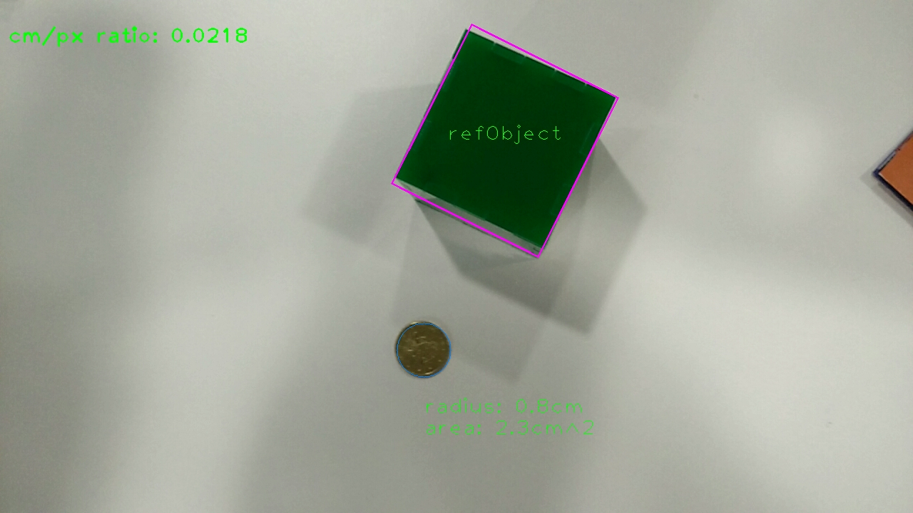
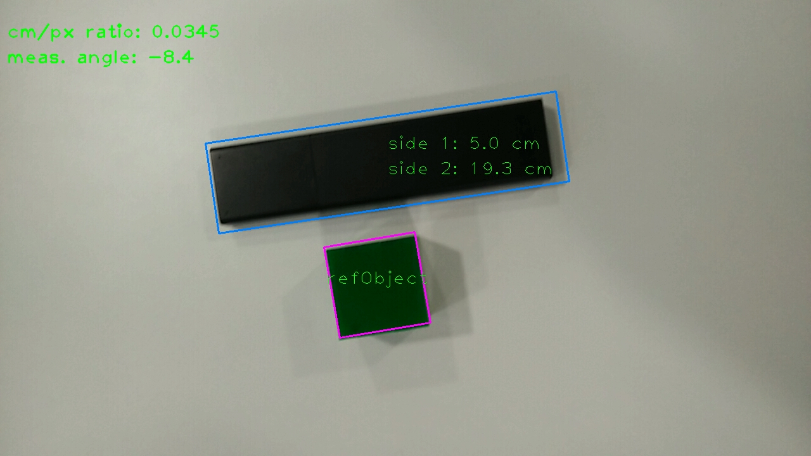

# android-measuring-tool

OpenCV based tool to measure objects using a green reference cube made by Janne Mustaniemi, Eemeli Ristimella and Joonas Jyrkkä.
The tool was made as a [Bachelor's thesis](kandidaatintyö.pdf). Unfortunately, it's written in Finish but the abstract is in English.

## Abstract for thesis
This bachelor’s thesis presents an Android-based solution to measure ubiquitous objects. The measurement process is executed by comparing measurable objects to a known reference object. The measures of the object will be added on top of camera feed. The crucial processes of the application are detecting the reference object and the measurable object.

The detection of the reference object is achieved on the basis of color information. The process starts with converting the camera feed to grayscale, and then applying Canny’s edge detection algorithm. The resulting binary image is dilated, and the contours of the image are detected using findCountours-method from OpenCV-library. The detected contour areas are filtered by color and size.
The detection of a measurable object begins also with grayscale-transform followed by binary thresholding. FindContours-method is applied to the resulting binary image, and the areas detected are filtered by size.

Two versions of the application were implemented, and they both were tested with predefined test suites. According to the tests, it seems the application succeeds to carry out the measurement process. However, there is still work to be done to enhance the detection rate especially in a challenging lightning environment and on patterned surfaces.

## Screenshots

